# 基于BERT的中文新闻文本分类项目

本项目使用PyTorch对BERT-base-chinese模型进行微调，用于复旦新闻数据集的多类别文本分类任务。
## 目录结构
├── dataset/\
│ └── fudan_news_test.csv # 测试数据集\
│ └── fudan_news_train.csv # 训练数据集\
├── src/\
│ ├── dataset_class.py # 训练用数据集类\
│ ├── train.py # 训练脚本\
│ ├── test.py # 测试脚本\
│ ├── news_train_logs/ # tensorboard缓存目录\
│ └── zh_cls_fudan-news_model/ # 模型保存目录\
├── README.md/ # 文档\
└── requirements.txt # 依赖列表\
## 训练步骤

## 快速开始

### 环境配置
```bash
# 安装依赖
pip install -r requirements.txt

# 基础训练（默认参数）
python src/train.py

# 启动TensorBoard（自动生成日志）
tensorboard --logdir=news_train_logs